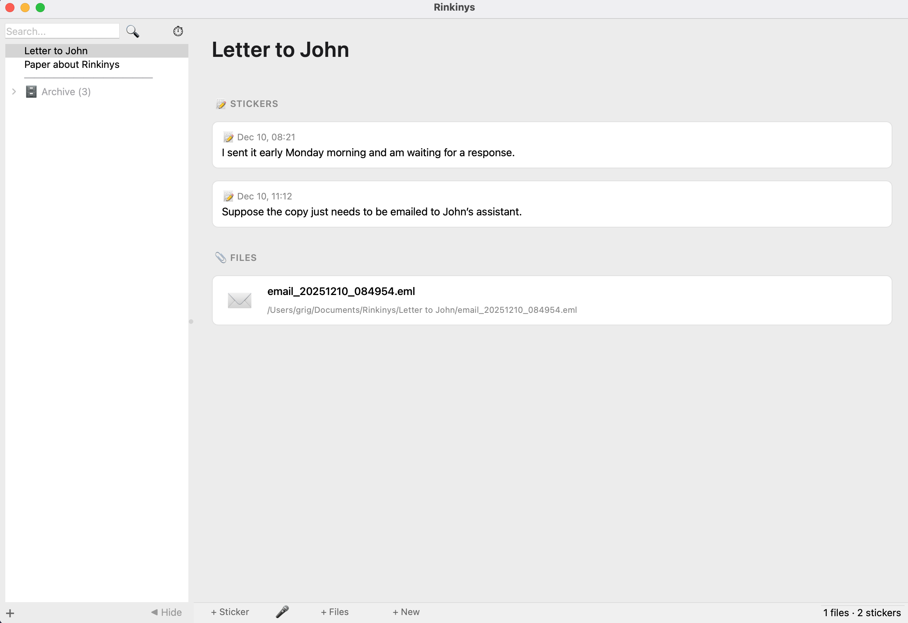
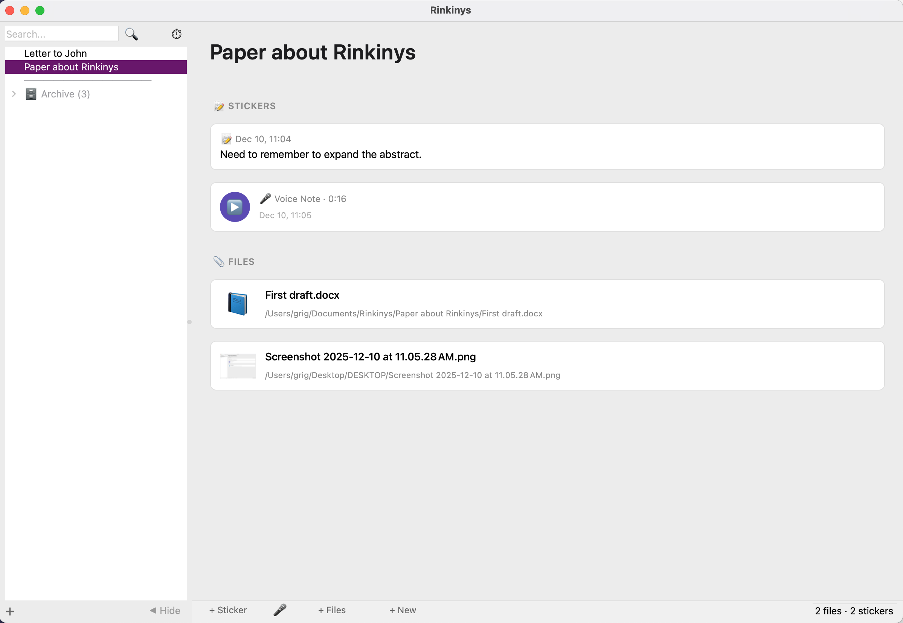
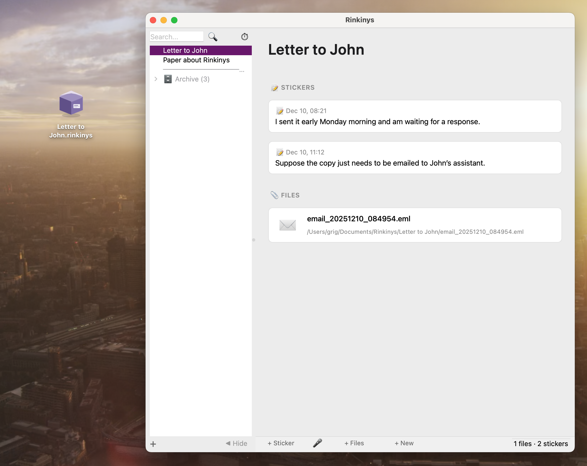

# Rinkinys

**Rich annotations for file groups - a semantic layer over the file system.** Projects's page: [rinkinys.app](https://rinkinys.app/)

Rinkinys (Lithuanian: "collection, set") is a desktop application that lets you organize files into sets with rich stickers (annotations), without moving the files from their original locations.





## Philosophy

We think in **entities**, not files. A project, a letter, a case — these are things we work with. But the file system gives us no way to annotate them, to add context that stays with the thing.

Rinkinys lets you create **sets** — virtual containers for files — and **stick notes on them**. A set can contain one file or many. The files stay where they are. The stickers stay with the set.

**Example:** You send an important email. Create a set, drag the email in. Stick a note: "Waiting for response". Days later, add another sticker: "They agreed, see attachment". Drag the attachment into the same set. Now you have a complete picture — not scattered across folders, but in one annotated entity.

- **Set** = a named group of files (like a labeled box)
- **Sticker** = annotation on the set (text, voice memo)
- **Files stay in place** — we track them by unique identifiers, not paths

```
┌─────────────────────────────────────────┐
│ ░░░░░░░░░░░░░░░░░░░░░░░░░░░░░░░░░░░░░░░ │  ← STICKERS (on the box)
│ ░ 📝 "Waiting for response"           ░ │     Your notes and context
│ ░ 🎤 voice memo from call             ░ │     Visible, always with the set
│ ░░░░░░░░░░░░░░░░░░░░░░░░░░░░░░░░░░░░░░░ │
│ ┌─────────────────────────────────────┐ │
│ │   ✉️ original_email.eml             │ │  ← FILES (inside the box)
│ │   📄 their_response.pdf             │ │     The actual content
│ │   📄 final_agreement.docx           │ │     Growing over time
│ └─────────────────────────────────────┘ │
└─────────────────────────────────────────┘
```

## Features

- ✅ Create sets and nest them hierarchically
- ✅ Add files/folders to sets via drag & drop
- ✅ Files can belong to multiple sets
- ✅ Text stickers for notes and context
- ✅ Voice stickers (audio memos)
- ✅ Files tracked by inode (survive renames/moves)
- ✅ Drag sets to Desktop → creates .rinkinys shortcut
- ✅ Archive instead of delete (safe removal)
- ✅ Mail.app integration (drag emails into sets)

## Download

> ⚠️ **This is an experimental prototype.** It works, but has rough edges.

**[Download Rinkinys.dmg](https://github.com/kalba-lab/rinkinys/releases/latest)**

Requirements:
- macOS 14+ (Sonoma)
- Apple Silicon (M1/M2/M3/M4)

### Installation

1. Download `Rinkinys.dmg`
2. Drag `Rinkinys.app` to Applications
3. **First launch:** Right-click → Open → Open (app is not notarized)

## Known Limitations

| Issue | Details |
|-------|---------|
| 🍎 macOS only | Apple Silicon required. Intel Macs not supported |
| 🔐 Gatekeeper | Right-click → Open on first launch |
| ✉️ Mail.app slow | Dragging emails takes 5-15 sec. Brief freeze is normal |
| 🎤 Voice needs FFmpeg | `brew install ffmpeg` for voice recording |
| ↩️ No Undo | Archive protects sets, but not individual file references |

## How It Works

1. **Create a Set** — Click + in sidebar
2. **Add Files** — Drag from Finder (files stay where they are)
3. **Add Context** — Stickers, voice memos
4. **Quick Access** — Drag set to Desktop for .rinkinys shortcut

### Technical Details

- **File Identity:** Files tracked by `volume_uuid + inode`, not path
- **Database:** `~/Library/Application Support/Rinkinys/rinkinys.db`
- **Voice files:** Saved to `~/Documents/Rinkinys/{SetName}/`
- **File search:** Uses Spotlight when files are moved

## Desktop Shortcut



Drag a set from sidebar to Desktop — it becomes a `.rinkinys` file with custom icon. Double-click to open.

## Tech Stack

- Python 3.11 + PySide6 (Qt)
- SQLite
- FFmpeg (optional)

## FAQ

**Q: Are my files copied?**  
A: No. Rinkinys only stores references.

**Q: What if I move a file?**  
A: Rinkinys tracks by inode and uses Spotlight to find moved files.

**Q: Can one file be in multiple sets?**  
A: Yes! That's the whole point.

## License

Proprietary — © 2025 Kalba Lab

---

[Kalba Lab](https://kalba.dev)
