# Rinkinys

**Rich annotations for file groups - a semantic layer over the file system.**

Rinkinys (Lithuanian: "collection, set") is a macOS app that lets you organize files into virtual sets with stickers (text notes, voice memos), without moving files from their original locations.

🌐 Website: [rinkinys.app](https://rinkinys.app/)

---

## Problem

We think in **entities** - projects, letters, cases - not files. But the file system gives us no way to annotate them, to add context that stays with the thing. You can't "stick a note" on a group of related files.

---

## Solution

Rinkinys introduces a **semantic layer** over your files:

```mermaid
graph BT
    subgraph FILES["Files (your actual files)"]
        F1["✉️ original_email.eml"]
        F2["📄 their_response.pdf"]
        F3["📄 final_agreement.docx"]
    end
    
    subgraph SET["📦 Set: Contract with Smith"]
        subgraph STICKERS["Stickers (semantic layer)"]
            S1["📝 Waiting for response"]
            S2["🎤 Voice memo from call"]
            S3["📝 They agreed, see attachment"]
        end
    end
    
    FILES --> SET
    
    style SET fill:#f5f0ff,stroke:#5b4bb3,stroke-width:2px
    style STICKERS fill:#fff9e6,stroke:#ffaa00
    style FILES fill:#ffffff,stroke:#cccccc
```

**Key concepts:**
- **Set** = a named group of files (like a labeled box)
- **Sticker** = annotation on the set (text, voice memo)
- **Files stay in place** - tracked by unique identifiers, not paths

---

## How It Works

1. **Create a Set** - Click + in sidebar, name it
2. **Add Files** - Drag from Finder (files stay where they are)
3. **Stick Notes** - Add text stickers or voice memos
4. **Quick Access** - Drag set to Desktop → creates .rinkinys shortcut

**Example:** Send an important email. Create a set, drag the email in. Stick a note: "Waiting for response". Days later, add another sticker: "They agreed". Drag the attachment into the same set. Complete picture - one annotated entity.

---

## Features

| | Feature | Description |
|---|---------|-------------|
| 📦 | **Virtual Sets** | Create and nest sets hierarchically |
| 📎 | **Drag & Drop** | Add files/folders from Finder, emails from Mail.app |
| 📝 | **Text Stickers** | Add notes and context to any set |
| 🎤 | **Voice Stickers** | Record audio memos (requires FFmpeg) |
| 🔍 | **Smart Tracking** | Files tracked by inode - survive renames/moves |
| 📄 | **Desktop Shortcuts** | Drag set to Desktop → .rinkinys file with custom icon |
| 🗄️ | **Archive** | Safe deletion - restore anytime |
| ✉️ | **Mail Integration** | Drag emails directly into sets |

---

## Install

> ⚠️ **Experimental prototype.** Works, but has rough edges.

**[Download Rinkinys.dmg](https://github.com/kalba-lab/rinkinys/releases/latest)**

- macOS 14+ (Sonoma), Apple Silicon (M1/M2/M3/M4)
- First launch: Right-click → Open → Open (not notarized)
- Voice recording: `brew install ffmpeg`

### First Launch (Important!)

The app is not notarized (Apple charges $100/year for this). MacOS will block it by default.

**To open:**
1. Try to open Rinkinys.app - macOS will show a warning
2. Open **System Settings → Privacy & Security**
3. Scroll down - you'll see "Rinkinys was blocked"
4. Click **Open Anyway**

Or: Right-click on Rinkinys.app → Open → Open

Known Limitations

| Issue | Details |
|-------|---------|
| 🍎 macOS only | Apple Silicon required, Intel not supported |
| 🔐 Gatekeeper | Right-click → Open on first launch |
| ✉️ Mail.app slow | Dragging emails takes 5-15 sec, brief freeze is normal |
| 🎤 Voice needs FFmpeg | `brew install ffmpeg` |
| ↩️ No Undo | Archive protects sets, not individual file references |

Technical Details

- **Database:** `~/Library/Application Support/Rinkinys/rinkinys.db`
- **Voice files:** `~/Documents/Rinkinys/{SetName}/`
- **File tracking:** `volume_uuid + inode`, Spotlight search for moved files

---

## FAQ

**Q: Are my files copied?**  
A: No. Rinkinys only stores references.

**Q: What if I move a file?**  
A: Rinkinys tracks by inode and uses Spotlight to find moved files.

**Q: Can one file be in multiple sets?**  
A: Yes! That's the whole point.

---

## Tech

Python 3.11 • PySide6 (Qt) • SQLite • FFmpeg (optional)

---

## License

Proprietary - © 2025 [Kalba Lab](https://kalba.dev)
